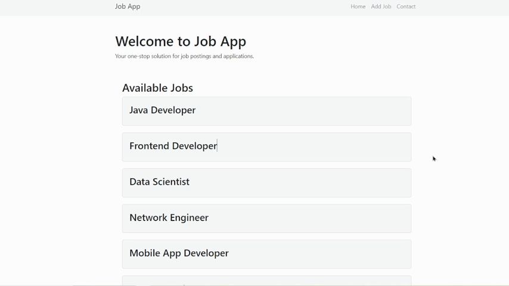

# Job Application Management System


## Table of Contents
- [About](#about)
- [Features](#features)
- [Demo](#demo)
- [Installation](#installation)
- [Usage](#usage)
- [API Endpoints](#api-endpoints)
- [Contributing](#contributing)
- [License](#license)

## About
Job Application Management System is a web application for managing job postings and applications. It allows to add, view a job postings, and provides a frontend interface for potential applicants to browse and apply for jobs.

## Features
- Add and view job postings
- Responsive design

## Demo



## Installation

### Backend
1. Clone the repository:
    ```sh
    git clone https://github.com/yourusername/jobApp.git
    ```
2. Navigate to the backend directory:
    ```sh
    cd jobApp/backend-jobapp
    ```
3. Install backend dependencies:
    ```sh
    mvn install
    ```
4. Run the backend server:
    ```sh
    mvn spring-boot:run
    ```

### Frontend
1. Navigate to the frontend directory:
    ```sh
    cd jobApp/fronted-jobapp
    ```
2. Install frontend dependencies:
    ```sh
    npm install
    ```
3. Start the frontend development server:
    ```sh
    npm start
    ```

## Usage
1. Open your browser and navigate to `http://localhost:3000` to view the application.
2. Use the admin panel to add job postings.
3. Browse job postings and apply for jobs.

## API Endpoints

### Skills
- `GET /skills` - Retrieve all available skills.

### Jobs
- `GET /allJobs` - Retrieve all job postings.
- `POST /addjob` - Add a new job posting.

## Contributing
Contributions are welcome! Please fork this repository and submit a pull request with your changes. 

1. Fork the repository
2. Create your feature branch (`git checkout -b feature/YourFeature`)
3. Commit your changes (`git commit -m 'Add some feature'`)
4. Push to the branch (`git push origin feature/YourFeature`)
5. Open a pull request

## License
This project is licensed under the MIT License. See the [LICENSE](LICENSE) file for details.

